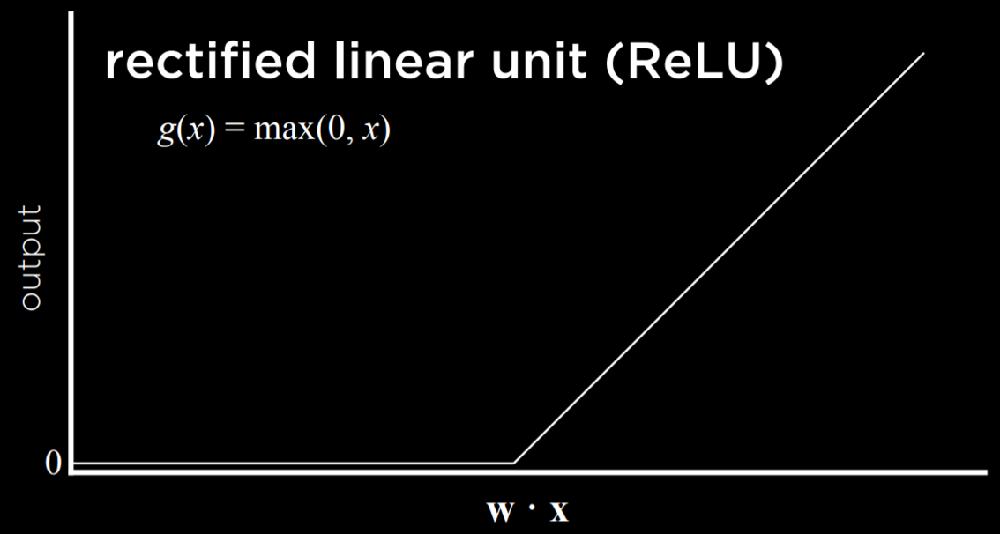
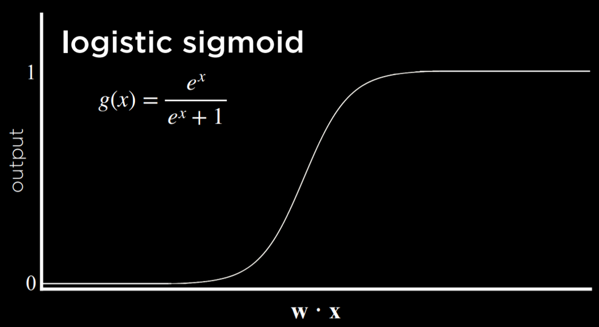
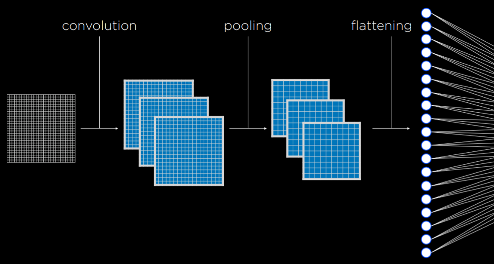

# Neural Network
Definition: Artificial neural networks model mathematical functions that map inputs to outputs based on the structure and parameters of the network. 

## Activation function

To determine the hypothesis, we need to decide some threshold based on the values they produce. 


<table>
  <tr>
    <th>Step function</th>
    <th>Logistic sigmoid</th>
    <th>Rectified linear unit</th>
  </tr>
  <tr>
    <td></td>
    <td></td>
    <td></td>
  </tr>
</table>


## Neural Network Structure

A neural network can be thought of as a representation of the idea above, where a function sums up inputs to produce an output.

1. Visualize an Or logical connective(use the step function)


2. Visualize an AND logical connective(use the step function)
-> we convert the ```g(-1 + 1x1 + 1x2)``` to ```g(-2 + 1x1 + 1x2)```


## Gradient descent
- An algorithm for minimizing loss when training neural network. In other words, it is an algorithm to figure out the appropriate weight.

### Standard Gradient Descent
* Start with a random choice of weights
* Repeat:
   * Calcuate the gradient based on **all data points(tricky part)**: direction that will lead to decreasing loss
   * Update weights according to the gradient

### Stochastic Gradient Descent
* Start with a random choice of weights
* Repeat:
   * Calcuate the gradient based on **one data point**: direction that will lead to decreasing loss
   * Update weights according to the gradient
Note that one data point may be used multiple times, , but it is much faster.

### Mini-Batch Gradient Descent
* Start with a random choice of weights
* Repeat:
   * Calcuate the gradient based on **one small batch**: direction that will lead to decreasing loss
   * Update weights according to the gradient
Note that one data point may be used multiple times,  but it is much faster.

E.g.
We might want to know more than “will it rain today?” We can use some inputs to generate probabilities for different kinds of weather, and then just choose the weather that is most probable.


Limitation of taking linear inputs
So far, our neural networks relied on perceptron output units. These are units that are only capable of learning a linear decision boundary, using a straight line to separate data. That is, based on a linear equation, the perceptron could classify an input to be one type or another (e.g. left picture). However, often, data are not linearly separable (e.g. right picture). In this case, we turn to multilayer neural networks to model data non-linearly.


## Multilayer neural network
Artificial neural network with an input layer, an output layer, and at least one hidden layer.


The middle layer is marked as hidden layer.

## Backpropagation
Definition: Algorithm for training neural networks with hidden layers.

* Start with a random choice of weights
* Repeat
  * Calculate error for output layer
  * For each layer, starting with output layer, and moving inwards towards earliest hidden layer
     * Propagate error back one layer
     * Update the weight

## Deep neural network
Definition: neural network with multiple hidden layer

## Overfitting
Solution:
dropout: temporarily removing units - selected at random - from a neural network to prevent over-reliance on certain units.

Tensorflow playground⬇️

playground.tensorflow.org


```python
import csv
import tensorflow as tf

from sklearn.model_selection import train_test_split

# Read data in from file
with open("banknotes.csv") as f:
    reader = csv.reader(f)
    next(reader)

    data = []
    for row in reader:
        data.append({
            "evidence": [float(cell) for cell in row[:4]],
            "label": 1 if row[4] == "0" else 0
        })

# Separate data into training and testing groups
evidence = [row["evidence"] for row in data]
labels = [row["label"] for row in data]
X_training, X_testing, y_training, y_testing = train_test_split(
    evidence, labels, test_size=0.4
)

# Create a neural network
model = tf.keras.models.Sequential()
# keras is an API, Sequential() means one layer after another

# Add a hidden layer with 8 units, with ReLU activation
model.add(tf.keras.layers.Dense(8, input_shape=(4,), activation="relu"))
#Dense Layer means each nodes in the layer is connected with node in next layer
#Hidden layer with 8 units


# Add output layer with 1 unit, with sigmoid activation
model.add(tf.keras.layers.Dense(1, activation="sigmoid"))
# one unit, one output


# Train neural network
model.compile(
    optimizer="adam", # optimize weight
    loss="binary_crossentropy", # type of loss function
    metrics=["accuracy"] 
)
model.fit(X_training, y_training, epochs=20) # go through data 20 times and keep updating the weight

# Evaluate how well model performs
model.evaluate(X_testing, y_testing, verbose=2)
```

## Computer vision
Definition: Computational methods for analyzing and understanding digital images

Hand written recognition

### image convolution
Applying a filter that adds each pixel value of an image to its neighbors, weighted according to a kernel matrix

* Image convolution is applying a filter that adds each pixel value of an image to its neighbors, weighted according to a kernel matrix. Doing so alters the image and can help the neural network process it.

* Different kernels can achieve different tasks. For edge detection, the following kernel is often used: kernel=[-1, -1, -1, -1, 8, -1, -1, -1, -1]


```python
import math
import sys

from PIL import Image, ImageFilter

# Ensure correct usage
if len(sys.argv) != 2:
    sys.exit("Usage: python filter.py filename")

# Open image
image = Image.open(sys.argv[1]).convert("RGB")

# Filter image according to edge detection kernel
filtered = image.filter(ImageFilter.Kernel(
    size=(3, 3), # size of the kernel
    kernel=[-1, -1, -1, -1, 8, -1, -1, -1, -1], #digit inside of the kernel
    scale=1
))


# Show resulting image
filtered.show()
```


Pooling: size of the input is reduced by sampling from regions in the input

max-pooling: pooling by choosing the maximum value in each region. Sampling from a particular region


## Convolutional neural network: neural network that uses convolution, usually for analyzing the images.


### Convolution
Convolution is a mathematical operation used in Convolutional Neural Networks (CNNs) to extract features from images.
It applies filters (kernels) that slide over the image, detecting patterns like edges, textures, and shapes.

$$
\begin{bmatrix}
10 & 20 & 30 & 40 \\
10 & 2  & 0  & 30 \\
40 & 20 & 30 & 40 \\
50 & 20 & 30 & 40
\end{bmatrix}
\hspace{1cm}
\begin{bmatrix}
0  & -1 &  0 \\
-1 & 5 & -1 \\
0  & -1 &  0 \\
\end{bmatrix}
\hspace{0.5cm} \rightarrow \hspace{0.5cm}
\begin{bmatrix}
10 & 20 \\
40 & 50 \\
\end{bmatrix}
$$

#### Three types of layers.
* Low-Level Features (Early Layers):
Detect basic patterns like edges, lines, and textures.
Example: Recognizing the outline of an object.

* Mid-Level Features (Intermediate Layers):
Combine low-level features to detect shapes and regions.
Example: Identifying parts of an object like eyes or wheels.

* High-Level Features (Deeper Layers):
Recognize abstract and semantic features, such as objects or scenes.
Example: Classifying the entire image (e.g., "cat" or "car").

### Pooling: size of the input is reduced by sampling from regions in the input



### Flattening: Convert a multi-dimensional tensor into a 1D vector.

Input: A multi-dimensional tensor (e.g., (batch_size, height, width, channels)).
Output: A 2D tensor of shape (batch_size, units), where units = height × width × channels.
For example:

If the input to Flatten() is a tensor of shape (batch_size, 7, 7, 32):
It will flatten each 7×7×32 feature map into a vector of size 7 × 7 × 32 = 1568.
The output shape will be (batch_size, 1568).

### Drop-out

Handwritting recognition

#### Read the basic understanding before so that you can understand the code below.

1. API: We can consider API(Application Programming Interface) as a menu in the restaurant that provides the communication between client and server. In this specific case, we can roughly regard API as the libaray in python that provides specific built-in functions. For instance, the NumPy library provides an API with functions like np.array() and np.mean(), the Requests library provides an API with methods like requests.get() and requests.post().

2. The introduction for the API used in this piece of code
TensorFlow is a low-level API for building machine learning models from scratch. Keras is a high-level API inside TensorFlow that simplifies the process of creating and training models. Relationship: TensorFlow provides the foundational tools, while Keras makes those tools easier to use, including defining the layers, managing weights and gradients and optimizing the model. tf.keras is the official high level API of Tensorflow. 

3. The MNIST dataset contains handwritten digits (0-9). It is a standard dataset for machine learning tasks involving image classification.

4. One-hot encoding converts categorical labels (e.g., class numbers like 0, 1, 2) into binary vectors. For instance, we will convert 1 into [1, 0, 0] and 2 into [0, 1, 0]


* training the neural network
```python
import sys
import tensorflow as tf

# Use MNIST handwriting dataset
mnist = tf.keras.datasets.mnist

# Prepare data for training
(x_train, y_train), (x_test, y_test) = mnist.load_data()
x_train, x_test = x_train / 255.0, x_test / 255.0 # Normalize the pixel values of the images to a range of [0, 1] by dividing by 255 (since pixel values range from 0 to 255).

#convert to the One-hot format
y_train = tf.keras.utils.to_categorical(y_train)
y_test = tf.keras.utils.to_categorical(y_test)

x_train = x_train
.reshape(
    x_train.shape[0], x_train.shape[1], x_train.shape[2], 1
)
# The extra dimension (1) is required because Convolutional Neural Networks (CNNs) expect input data in a specific format:
# (batch_size, height, width, channels) For instance, it will shape (60000, 28, 28) into (60000, 28, 28, 1)
x_test = x_test.reshape(
    x_test.shape[0], x_test.shape[1], x_test.shape[2], 1
)

# Create a convolutional neural network
model = tf.keras.models.Sequential([

    # Convolutional layer. Learn 32 filters using a 3x3 kernel
    tf.keras.layers.Conv2D(
        32, (3, 3), activation="relu", input_shape=(28, 28, 1)
    ),
    '''32: Number of filters (feature detectors). (3, 3): Size of the filters (kernel).activation="relu": Applies the ReLU activation function to introduce 
    non-linearity. input_shape=(28, 28, 1): Specifies the shape of the input images (28x28 pixels with 1 channel(the scale is 1)). The input size caters the 
    size of of MNIST format'''

    # Max-pooling layer, using 2x2 pool size, basically finding the max number in the 4*4 grid
    tf.keras.layers.MaxPooling2D(pool_size=(2, 2)),

    # The line of code tf.keras.layers.Flatten() is a layer in TensorFlow's Keras library that is used to convert a multi-dimensional tensor 
    #  into a 1D vector.
    tf.keras.layers.Flatten(),

    # Add a hidden layer with dropout
    tf.keras.layers.Dense(128, activation="relu"),
    tf.keras.layers.Dropout(0.5),

    # Add an output layer with output units for all 10 digits
    tf.keras.layers.Dense(10, activation="softmax")
])

# Train neural network
model.compile(
    optimizer="adam",
    loss="categorical_crossentropy",
    metrics=["accuracy"]
)
model.fit(x_train, y_train, epochs=10)

# Evaluate neural network performance
model.evaluate(x_test,  y_test, verbose=2)

# Save model to file
if len(sys.argv) == 2:
    filename = sys.argv[1]
    model.save(filename)
    print(f"Model saved to {filename}.")
```


 ## feed-forward neural network : neural network that one have connection in one single direction


## Recurrent Neural Networks : consist of a non-linear structure, where the network uses its own output as input


Recurrent neural networks are helpful in cases where the network deals with sequences and not a single individual object. Above, the neural network needed to produce a sequence of words. 
